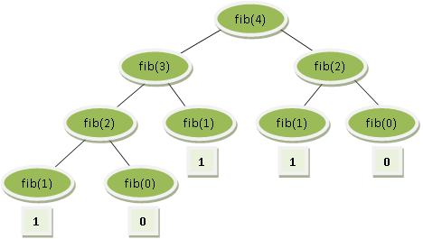

# Fibonacci, How Many Calls?
_beecrowd | 1029_

[1029 - Fibonacci, How Many Calls?](https://www.beecrowd.com.br/judge/en/problems/view/1029)

LEVEL 4 

Sometimes when you are a Computer Science student, you’ll see an exercise or a problem involving the Fibonacci sequence. This sequence has the first two values 0 (zero) and 1 (one) and each next value will always be the sum of the two preceding numbers. By definition, the formula to find any Fibonacci number is:
fib(0) = 0
fib(1) = 1
fib(n) = fib(n-1) + fib(n-2);

One way of finding Fibonacci numbers is by recursive calls. This is illustrated below, presenting the tree of derivation when we calculate fib(4), i.e. the fifth value of this sequence:

 

In this way, 
- fib(4) = 1+0+1+1+0 = 3
- 8 recursive calls were done.

## Input

The first input line contains a single integer N, indicating the number of test cases. Each test case contains an integer number X (1 ≤ X ≤ 39) .

## Output

For each test case we will have an output line, in the following format: fib(n) = num_calls calls = result, where num_calls is the number of recursive calls, always with a space before and after the equal sign, as shown below.

## Example:

|Input Sample | Output Sample |
| -- | -- |
| 2 5 4 |  fib(5) = 14 calls = 5  fib(4) = 8 calls = 3 |
